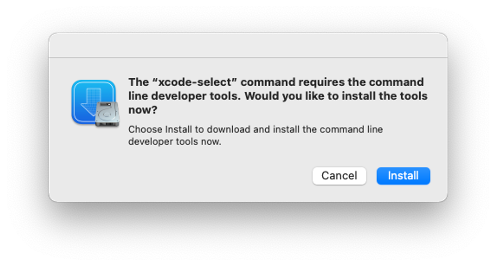

# Compiling for MacOS

### Getting Started

Recommended / Required Development Utilities

[NodeJS](https://nodejs.org/en)

[Bun](https://bun.sh)

### Git

Installing git on macOS can be done in 2 ways (both of these you need git)

Run `git` and you should see a pop-up like this, click install.

<figure><figcaption></figcaption></figure>

### Cloning the repository

Open a command prompt window in the directory where you want Git to clone, and enter the following command.

`git clone https://github.com/Zolvy/AppleMusicElectron`

## **Installing Dependencies**

Feel free to use any node package manager [pnpm](https://pnpm.io/), [Yarn](https://yarnpkg.com/), [npm](https://nodejs.org), [Bun](https://bun.sh), etc, run this command depending on your package manager.

`pnpm install`

## **Compiling AME**

Same command just a different file

`quasar build -m electron`

## Installing AME

Congratulations! You can find the file in the /builds folder
